# Ripple Effect Model

## 1. Introduction to the Ripple Effect Model

You have been doing solid work for a year. Your manager says you are performing well. But if you ask what "the next level" looks like in practice, the answer is vague.

The **Ripple Effect Model (REM)** is a tool to answer that question. Like a stone dropped in water, your work starts at the center and spreads outward. You begin by doing your own work well. Over time, you help the people around you. Then your whole domain. Eventually, the whole company.

This model helps:

- **People looking for the next step:** You do your work well but want to know how to make a bigger impact.
- **People between promotions:** You want to keep growing even when title changes are far away.
- **Teams that need a clear map:** Groups trying to figure out what "senior" or "advanced" means in daily work.
- **New hires:** People who just joined and want to know what success looks like over time.

Growing your skills often means you are ready for a promotion. But this model is not a guaranteed promotion path or a replacement for your normal job review. It is a tool to use alongside your goals.

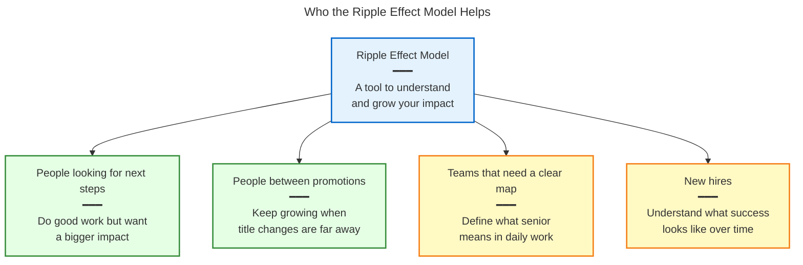

## 2. The Four Rings

The REM has four rings. Each ring adds more impact on top of the last.

| Ring       | Name             | What it adds                                                     |
| ---------- | ---------------- | ---------------------------------------------------------------- |
| **Ring 1** | **Core**         | Doing your own work well and owning your own tasks.              |
| **Ring 2** | **Team**         | Ring 1 + organizing your team and sharing knowledge.             |
| **Ring 3** | **Domain**       | Rings 1–2 + owning a whole platform or area of work.             |
| **Ring 4** | **Organization** | Rings 1–3 + teaching the entire company how to do things better. |

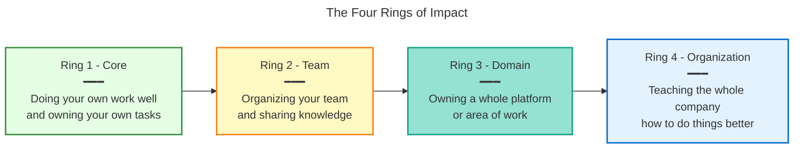

## 3. How Growth Works

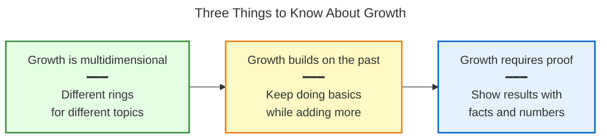

### Growth is multidimensional

Growing in your career is not a single straight line. You do not have one fixed ring for your entire job. You might be at Ring 3 for writing code, but at Ring 1 for mentoring people.

Because your work covers many topics, you will likely operate at different rings for different areas. You have reached a ring for a specific topic only when you can consistently show the results that ring requires.

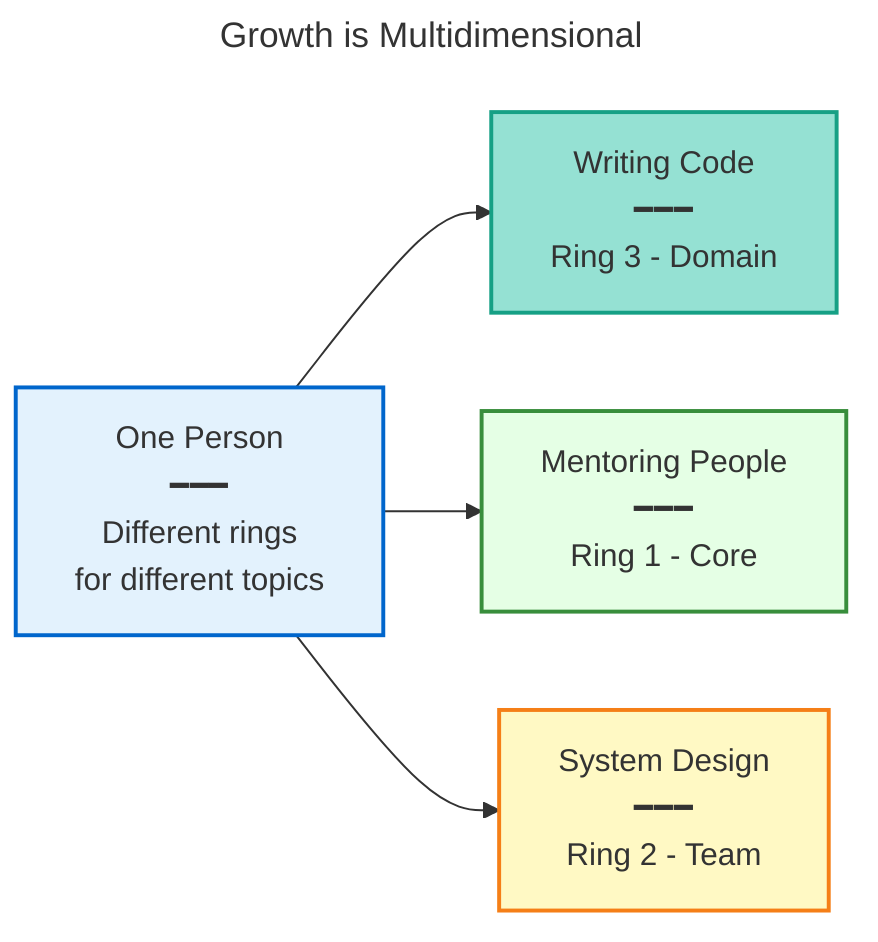

### Growth builds on the past

Growing does not mean leaving old work behind. You keep doing the basics — but better. You also start taking on bigger responsibilities.

Some common wrong ideas:

- "I got to the next ring, so I do not build things anymore." ❌
- "Ring 1 work is beneath me." ❌
- "Growing means making others do the basics." ❌

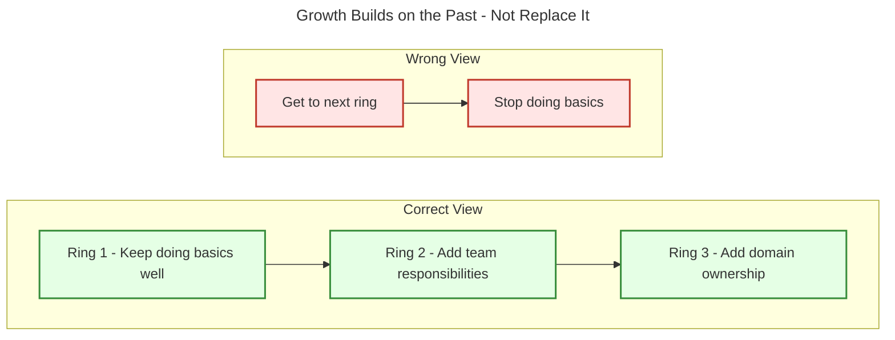

### Show your work

Do not just say you did a good job. Show it with facts and numbers. You need clear proof that your work helped others.

- ❌ "Shows leadership."
- ✅ "Helped the team finish reviews 40% faster by creating a new checklist."
- ✅ "Reduced system crashes by 18% by writing a fix-it guide."

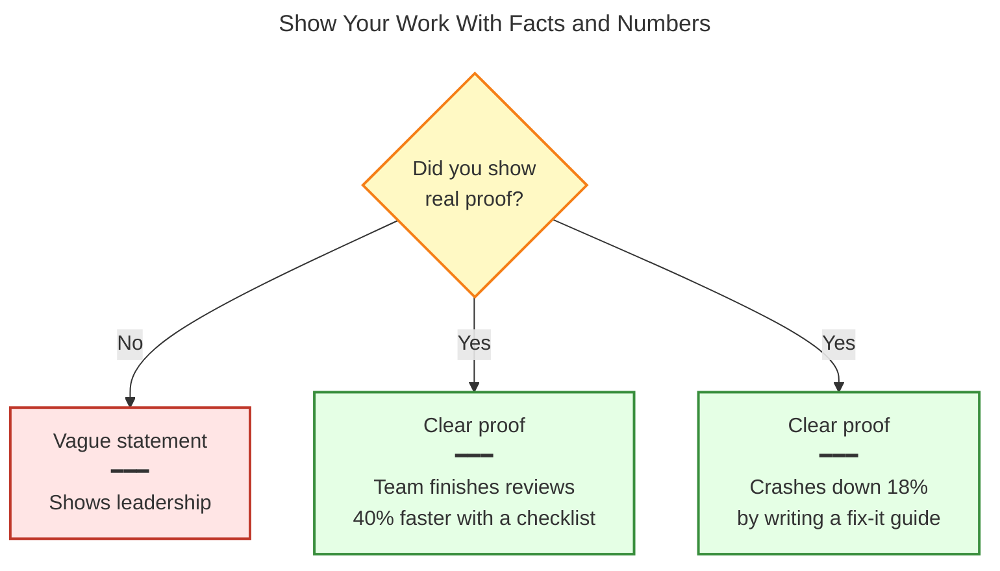

### How many topics should you track?

You do not need to track every part of your job. Pick two or three topics that matter most to your current goals. Going deep on a few areas is more useful than spreading thin across many.

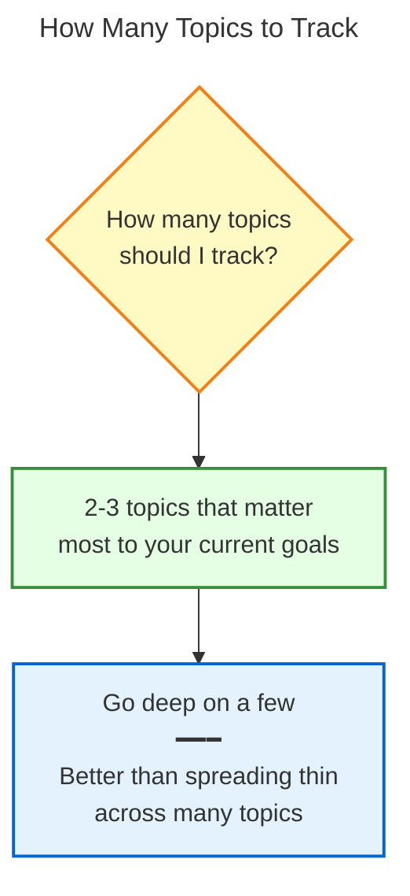

### What if you slip back?

Growth is not always a straight path forward. You might lose ground in a ring if you stop doing that work consistently. If that happens, focus on rebuilding the habit, not on the label. Ask yourself: "What would someone at this ring actually do this week?"

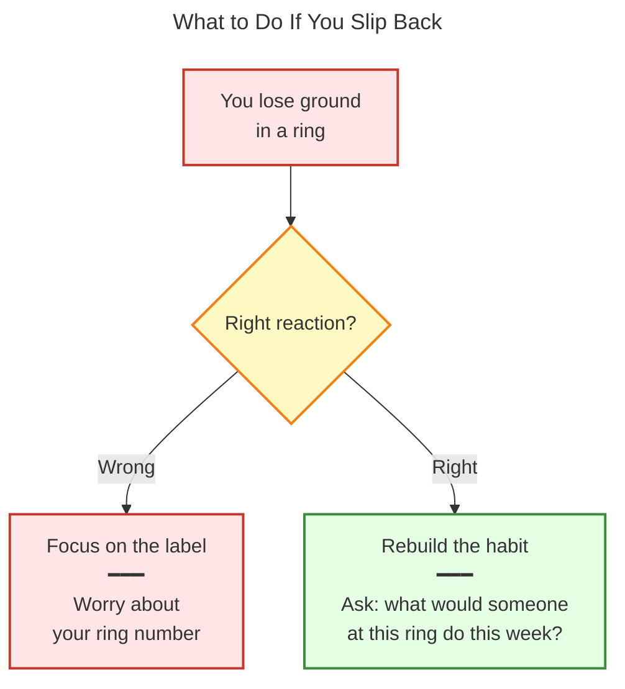

---

## 4. Building Your Impact Plan

An **Impact Plan** maps your specific role, daily tasks, and current goals across the four rings. It shows where you are now and what to do to reach the next ring for any given topic.

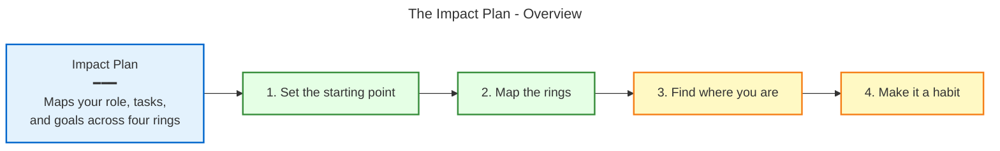

### Four steps to build your Impact Plan

1. **Set the starting point.** Write down your exact details: your role, your daily work, your current goals, and current challenges.
2. **Map the rings.** Ask yourself: "What does this goal look like when I expand my impact?"
   - **Ring 1 (Core):** How do I hit this goal in my own work?
   - **Ring 2 (Team):** How do I help my team hit this goal?
   - **Ring 3 (Domain):** How do I build systems so my whole domain hits this goal?
   - **Ring 4 (Organization):** How do I change how the whole company reaches this goal?
3. **Find where you are.** Compare your actual work to the rings you just mapped. Look for real proof, not just intention. Find the lowest ring where you answer "No" or "partially" — that is your next focus.
4. **Make it a habit.** Use this plan in your 1-on-1 meetings to talk about your growth. Check your goals every month, verify your ring progress every quarter, and update your starting point every year.

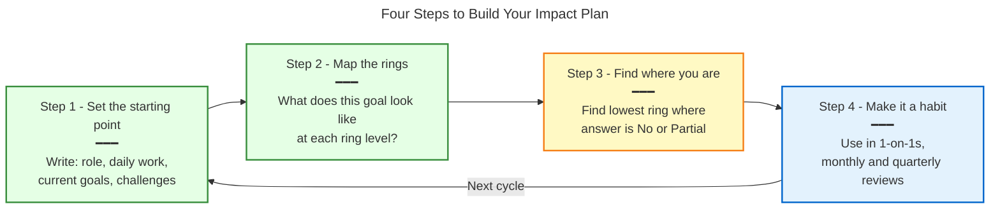

### Example: Erika Mustermann, Data Engineer

**1. Starting point:** Writes data pipelines using Airflow.

**Current goal:** Improve pipeline reliability and reduce failing jobs by 20%.

**2. The rings mapped:**

| Ring                      | What Erika should be doing                                                                   | Is Erika doing this today?                                             |
| ------------------------- | -------------------------------------------------------------------------------------------- | ---------------------------------------------------------------------- |
| **Ring 1 (Core)**         | Fixes bugs in their own pipelines so they hit 99% uptime.                                    | ✅ Yes. Erika consistently fixes their own pipelines.                  |
| **Ring 2 (Team)**         | Writes a standard error-handling guide and teaches the team, reducing team errors.           | ✅ Yes. Erika drafted a guide and held a team workshop.                |
| **Ring 3 (Domain)**       | Builds an automated alerting system that the entire engineering domain uses to catch errors. | ❌ No. The engineering domain is not actively using Erika's tools yet. |
| **Ring 4 (Organization)** | Builds a company-wide data quality practice with automated checks, crossing departments.     | ❌ No.                                                                 |

**3. Where Erika is:**

Erika is strong at Ring 2 for this topic. Erika has not reached Ring 3 yet because the engineering domain is not using the new alerting system. The next clear step is to drive broader adoption of that tool.

**4. Making it a habit:**

Erika will bring this plan to their manager to align on driving domain-wide adoption this quarter.

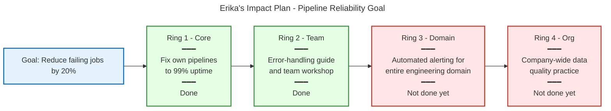

---

## 5. Using It Day to Day

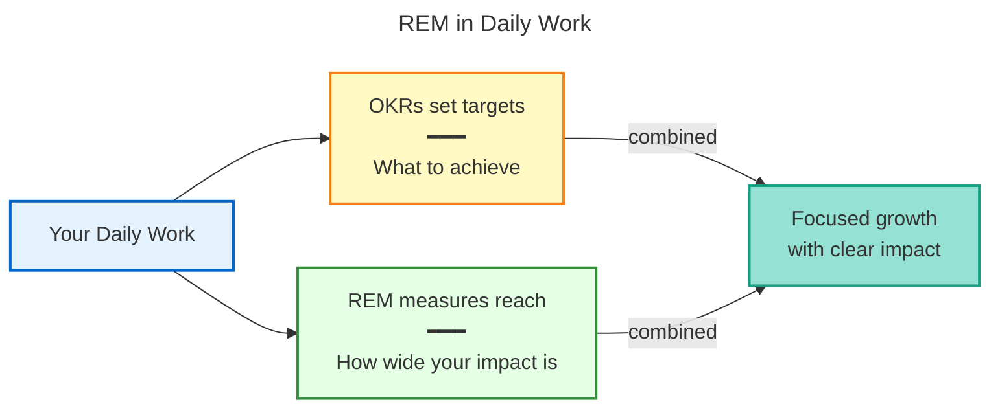

### Pairing with OKRs

Company goals like OKRs (Objectives and Key Results) tell you what to achieve. The REM tells you how wide your impact should be while reaching those goals. They work best together.

- **OKRs set the target.** They define the exact results you need (e.g., "Spend 15% less on infrastructure").
- **REM measures your reach.** It shows how wide your impact can reach.

| System                    | Purpose        | Example                                                            |
| ------------------------- | -------------- | ------------------------------------------------------------------ |
| **OKR**                   | The target     | "Spend 15% less on infrastructure."                                |
| **Ring 1 (Core)**         | Your impact    | You cut costs on your own projects.                                |
| **Ring 2 (Team)**         | Team impact    | You help your team cut costs together.                             |
| **Ring 3 (Domain)**       | Domain impact  | You write guidelines that save money across your whole department. |
| **Ring 4 (Organization)** | Company impact | You change how the whole company buys and manages infrastructure.  |

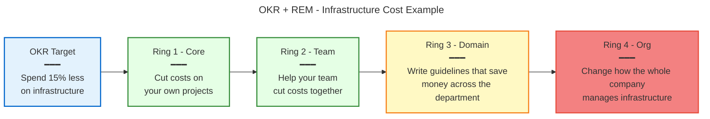

### A regular review rhythm

- **Monthly:** Check your current goals against your Impact Plan.
- **Quarterly:** Verify your ring progress for each topic and update your next steps.
- **Yearly:** Revisit your starting point. Have your role or goals changed?

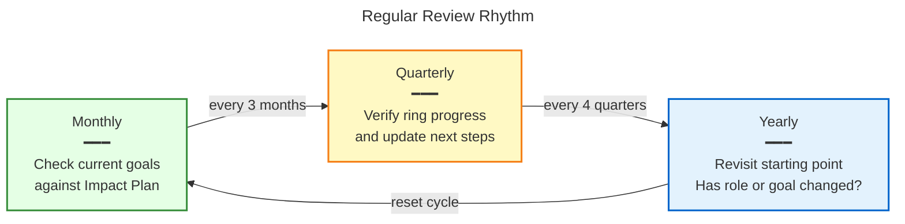

---

## 6. Reference

### Common questions

**Q: Do I need to finish every task in a ring before moving up?**

A: No. You can work on multiple topics at different rings at the same time. Moving up means you are consistently showing the required impact for a specific topic at that ring.

**Q: What if my job does not fit these rings exactly?**

A: These rings are examples, not strict rules. Change the descriptions so they fit your exact role.

**Q: How long should I stay at each ring?**

A: There is no set time. Moving up depends on the work available, how complex the work is, and the results you can clearly show.

**Q: What if I think my ring should be higher?**

A: Show proof. Bring clear numbers and facts showing you have been doing the work of the higher ring consistently for at least 3 to 6 months.

---

### Glossary

| Term                               | Definition                                                                                                                                        |
| ---------------------------------- | ------------------------------------------------------------------------------------------------------------------------------------------------- |
| **Ripple Effect Model (REM)**      | A four-ring model showing how career impact grows from Core to Organization.                                                                      |
| **Impact Plan**                    | A personal four-step growth plan built using your exact role, daily tasks, and goals.                                                             |
| **Ring**                           | One of four growth stages: Core, Team, Domain, Organization. Each ring builds on the last.                                                        |
| **Clear proof**                    | A specific result with a real number attached to it.                                                                                              |
| **OKR (Objective and Key Result)** | A goal-setting format that defines a target and the results that show you hit it. Used alongside the REM to connect your growth to company goals. |

---

### Writing and phrasing guidelines

To keep this document — and all future REM materials — easy to read, follow these rules when writing or editing.

1. **Use simple, direct sentences.**
   Write as if you are explaining something to someone on their first week at work. Keep sentences short and active.
   - _Avoid:_ "It provides a practical guide for individuals to leverage the REM as a tool for deepening impact."
   - _Use:_ "You can use this guide to grow your skills and make a bigger impact."

2. **Break complex ideas into smaller pieces.**
   If an idea has multiple steps or concepts, split it into separate sentences or bullet points. Do not pack too many ideas into one sentence.

3. **Remove jargon.**
   Replace dense or buzzword-heavy phrases with plain language.
   - _Avoid:_ "multiplying strategic impact," "executing discrete deliverables," "radius of influence," "driving cross-functional alignment."
   - _Use:_ "helping your whole company succeed," "doing your own tasks," "how far your work reaches," "working with other teams."

4. **Use formatting to help readers scan.**
   Use bold for key terms on first use. Use numbered lists for steps and bullet points for grouped items. Keep paragraphs short — two to three sentences at most.

5. **Write for people, not for processes.**
   This document is for real people trying to grow. Avoid language that sounds like a policy manual or a performance review form.
   - _Avoid:_ "Upon demonstration of requisite competencies at the designated maturity tier..."
   - _Use:_ "Once you can consistently show the skills needed at this ring..."

6. **Use second person ("you") throughout.**
   Address the reader directly. Avoid passive voice and third-person abstractions.
   - _Avoid:_ "Employees are expected to demonstrate impact at their current ring."
   - _Use:_ "Show your impact at your current ring before moving to the next."
