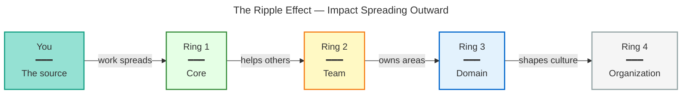
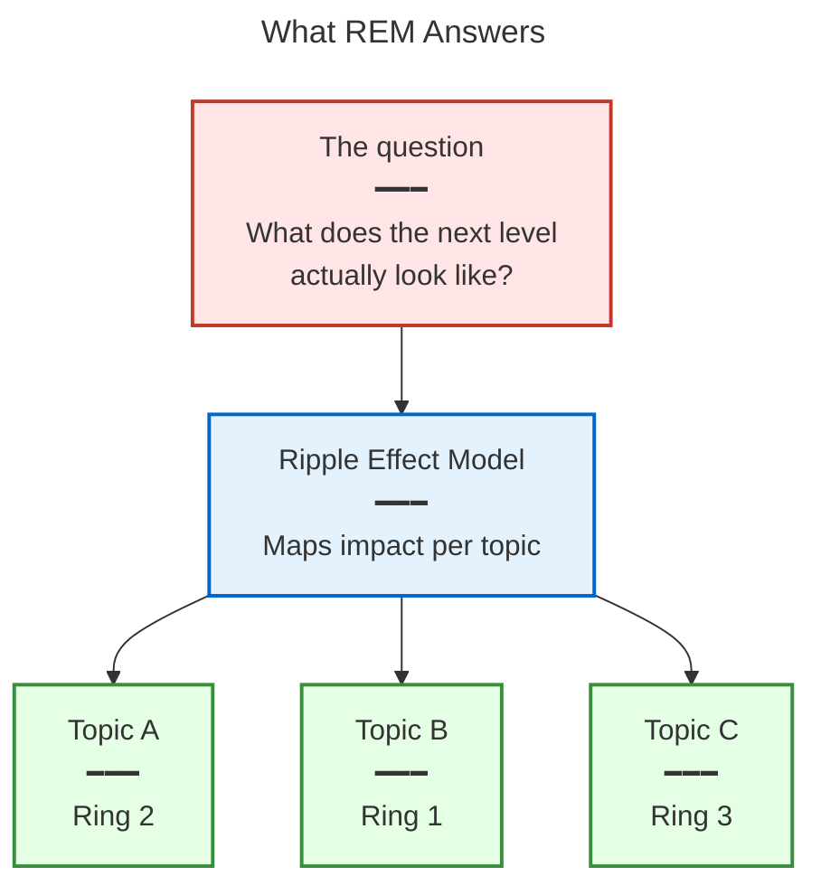
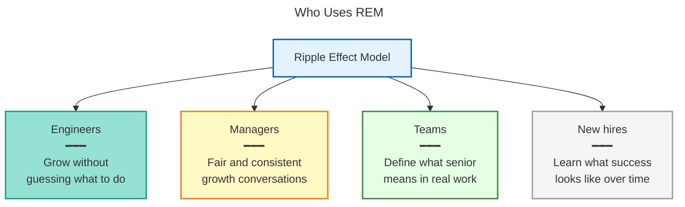
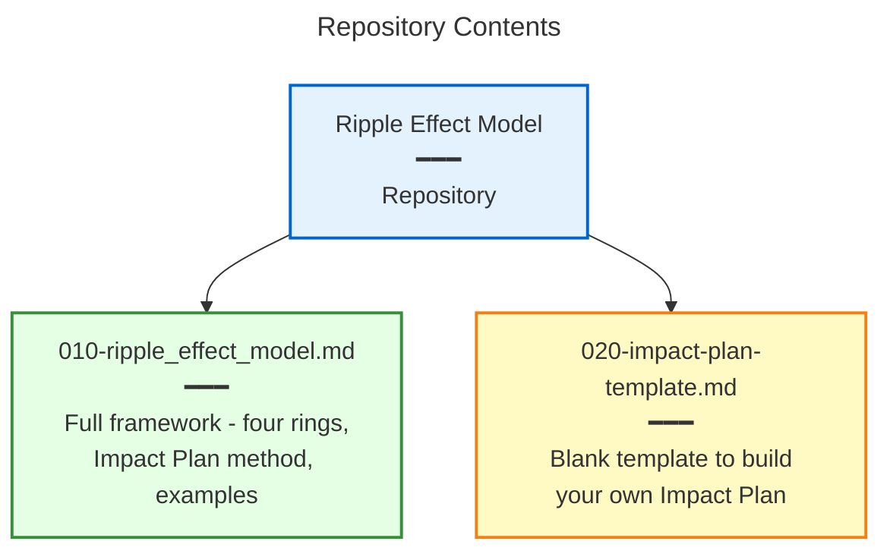
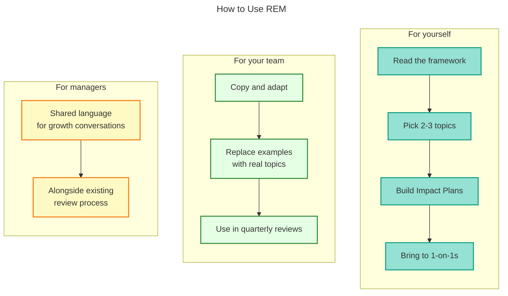
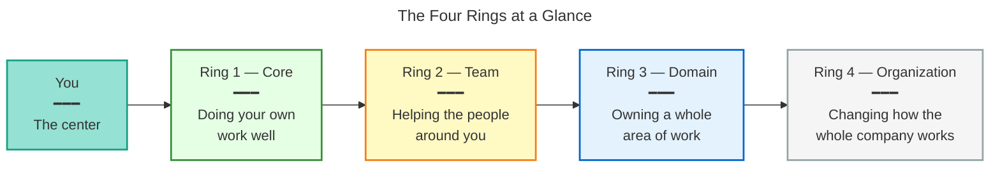

# Ripple Effect Model

A lightweight framework for making career growth concrete — for engineers, managers, and teams.

## What it is

The **Ripple Effect Model (REM)** maps how individual impact grows outward. Like a stone dropped in water, your work starts at the center and spreads out — from your own tasks, to your team, to your whole domain, to the organization.

It answers a question most engineers hit at some point:

> "My manager says I'm doing well. But what does _the next level_ actually look like in practice?"

REM gives you a concrete answer for any topic you care about.

## Who it is for

- **Engineers** who want to grow but don't know what to do differently
- **Managers** who want consistent, fair conversations about growth
- **Teams** trying to define what "senior" or "staff" means in real work, not just titles
- **New hires** learning what success looks like over time

## What's in this repo

| File                                                       | What it contains                                                                                    |
| ---------------------------------------------------------- | --------------------------------------------------------------------------------------------------- |
| [010-ripple_effect_model.md](010-ripple_effect_model.md)   | The full REM framework: four rings, the Impact Plan method, worked examples, and writing guidelines |
| [020-impact-plan-template.md](020-impact-plan-template.md) | A blank template to build your own Impact Plan                                                      |

## How to use it

**For yourself:** Read [010-ripple_effect_model.md](010-ripple_effect_model.md), pick two or three topics you want to grow in, and use [020-impact-plan-template.md](020-impact-plan-template.md) to build your Impact Plans. Bring them to your 1-on-1s.

**For your team:** Copy and adapt this repo. Replace the example with your team's real topics. Fill in the template for each person. Use it in quarterly reviews.

**For managers:** The framework is not a performance review replacement. It's a shared language for growth conversations. Use it alongside your existing review process.

## Quick look: the four rings

| Ring       | Name         | What it means                        |
| ---------- | ------------ | ------------------------------------ |
| **Ring 1** | Core         | Doing your own work well             |
| **Ring 2** | Team         | Helping the people around you        |
| **Ring 3** | Domain       | Owning a whole area of work          |
| **Ring 4** | Organization | Changing how the whole company works |

You don't have one ring. You have a ring per topic, and they can all be different.

## License

MIT — use it, adapt it, share it. See [LICENSE](LICENSE).

## Contributing

Ideas, fixes, and real-world examples are welcome. See [CONTRIBUTING.md](CONTRIBUTING.md).
